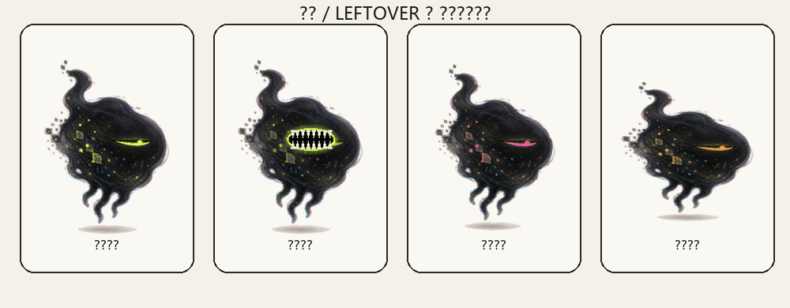

# 余食 / LEFTOVER

一只生活在 Windows 桌面上的异食癖宠物。

把不要的文件拖到它身上，它会张嘴询问；确认后文件进入系统回收站，宠物咀嚼、变色，并评价味道。误投文件仍可从回收站恢复。

## 支持平台

目前仅支持 Windows 10/11 x64。

macOS 与 Linux 暂不支持，Windows ZIP 不能在这些系统上直接运行。未来需要分别适配系统废纸篓、托盘和应用打包方式。

## 下载运行

推荐从 GitHub Releases 下载 Windows ZIP：

1. 完整解压 ZIP。
2. 打开解压后的文件夹。
3. 双击 `LEFTOVER.exe`。
4. 不要把 EXE 单独移出文件夹；旁边的 `_internal` 目录是运行必需的。

如果 Windows SmartScreen 提示“未知发布者”，可选择“更多信息”后确认运行。

## 核心功能

- 文件拖入、确认、咀嚼和进食变色
- 趴伏、张嘴、变色和随机待机动作
- SHA-256 完整哈希重复文件扫描
- 桌面与下载目录垃圾候选扫描
- 宠物对话、食谱与味觉评价
- 屏幕侧边折叠、系统托盘和单实例运行

## 安全边界

- 拖入文件后必须确认。
- 文件只会移动到 Windows 系统回收站，不会直接永久删除。
- 扫描结果默认不选择任何文件。
- 不上传文件内容，不连接云端。

## 源码运行

需要 Python 3.11+：

    python -m pip install -r requirements.txt
    python leftover_pet.py

## 打包

    .\build.ps1 -Clean

本项目是一个 Windows 异食癖桌宠实验原型。
