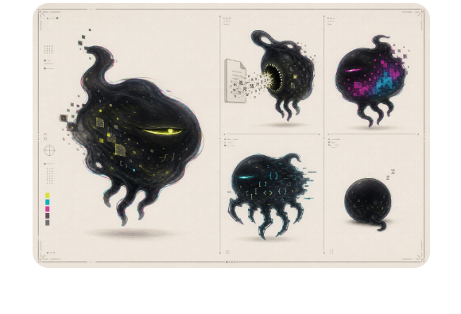

# 余食 / LEFTOVER

一只生活在 Windows 桌面上的数字异食宠物。

把不要的文件拖到它身上，它会张嘴询问；确认后文件进入系统回收站，宠物咀嚼、变色，并评价味道。误投文件仍可从回收站恢复。

## 下载运行

推荐从 GitHub Releases 下载 Windows ZIP：

1. 解压 ZIP。
2. 双击“余食.exe”。
3. 如果 Windows SmartScreen 提示未知发布者，选择“更多信息”后确认运行。

程序会驻留系统托盘。右键宠物可以扫描重复文件和桌面垃圾、查看食谱、打开回收站、折叠或退出。

## 核心功能

- 文件拖入、确认、咀嚼和进食变色
- 同一身体的液态、趴伏、张嘴和随机待机动作
- SHA-256 完整哈希重复文件扫描
- 桌面与下载目录垃圾候选扫描
- 宠物对话、食谱与味觉评价
- 屏幕侧边折叠、系统托盘和单实例运行

## 安全边界

- 拖入文件后必须确认。
- 文件只会移动到 Windows 系统回收站，不会直接永久删除。
- 扫描结果默认不选择任何文件。
- 不上传文件内容，不连接云端。

## 源码运行

需要 Python 3.11+：

    python -m pip install -r requirements.txt
    python leftover_pet.py

## 打包

    .\build.ps1 -Clean

本项目是一个 Windows 桌面宠物实验原型。
